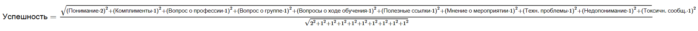
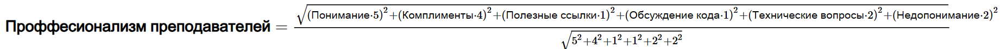
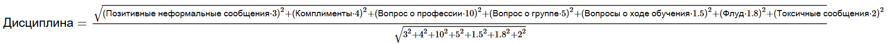
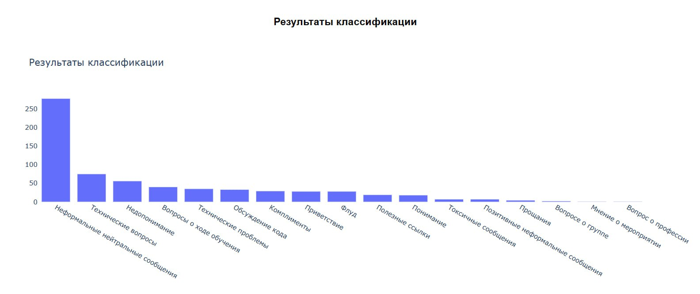
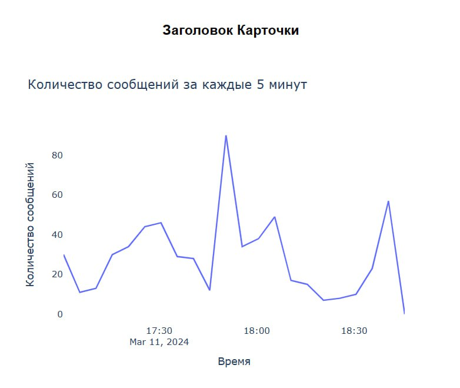

# Команда КШАД: Решение кейса "Анализ преподавания"
&nbsp;&nbsp;В рамках хакатона мы должны были:
Создать автоматизированный инструмент анализа комментариев учащихся.
Наличие интерфейса для интерактивного мониторинга и анализа комментариев к уроку. Интерфейс
позволяет задавать параметры для определения и отслеживания ключевых индикаторов процессов
обучения, таких как активность и поведение учащихся, технические проблемы с платформой и
наличие стоп-слов.
## Как пользоваться интерфейсом?

1. Скачайте архив с моделями с [яндекс диска](https://disk.yandex.ru/d/rGe0fGk9n6BmnQ). (Гитхаб не позволяет размещать файлы весом более 100мб).
2. Распакуйте архив с моделями внутри папки src. После этого шага путь до моделей должен начинаться с 'src/models/...'.
3. В терминале выполните команду:
   ```bash
   cd src
   python app.py
   ```
4. Приложение развернется на локальном сервере и подгрузит модели.
5. Сервис позволит выбрать файл для анализа. **КРАЙНЕ РЕКОМЕНДУЕМ** использовать предоставленный нами в репозитории файл (sample.csv) во избежание ошибок в кодировоках, проблемных заголовках, а самле главное наш файл позволит увидеть возможности нашего инструмента. 

## Что из себя представляет ваш продукт?

&nbsp;&nbsp;Наш продукт: разврнутая дашборд система, которая принимает на вход комментарии и выдает продвинутую аналитику по ним. Наше решение позволит скорректировать учебные курсы для кейсодержателя и соответсвенно не только увеличить прибыль компании, но и улучшить качество преподаваемого материала.

## Разбор решения:

### Техническая часть решения:

&nbsp;&nbsp;Изначально, в презентации кейса была четко указана задача, где понадобится наше решение - обработка комментариев в реальном времени. Поэтому самое простое и очевидное решение (через LLM) не выдерживает никакой критики. Это решение не позволяет достичь какой-либо достойной производительности, и обработка 50-100 комментариев на адекватном количестве ресурсов будет занимать 2-3 минуты.

Поэтому наш взор упал в сторону легковесных моделей. Но так как эмерджентными свойствами они не обладают, то им нужна разметка. После визуального анализа мы выделили 20 основных классов на которые можно разделить данные нам комментарии и приступили к разметке.

Мы разметили большое количество комментариев и обучили три BERT классификатора. Наша схема классификации похожа на дерево. Изначально комментарий попадает в модель 1 (бинарную), она разделяет сообщения на полезные и бесполезные. Далее, когда сообщение получит свой класс оно в зависимости от класса направляется в две разные модели, которые уже определяют финальный класс для сообщения.

### Производительность моделей:

&nbsp;&nbsp;Все наши BERT модели в комплексе на CPU делают от 30 до 300 классификаций в секунду, а на GPU от 150 до 500 классификаций в секунду, также с учетом маленького веса моделей всего 150 мб на серверах можно размещать параллельно несколько моделей. Что позволит нашим моделям обрабатывать практически любое количество одновременно поступающих комментариев.

### Непосредственно анализ комментариев:

&nbsp;&nbsp;Для полноценного анализа качества преподавания, ...

1. **Прокси-метрики для оценки успешности урока / дисциплинированности студентов / профессионализма преподавателя:**

    По итогам нашего пайплайна получается довольно обширная статистика из нескольких десятков значений, которые очень трудно интерпретировать вместе. Поэтому мы разработали специальные прокси-метрики для отслеживания:

    - **Успешность урока**
    - **Дисциплинированность студентов**
    - **Профессионализм преподавателя**

    ### Идея

    Идея состоит в том, что вместо одновременной интерпретации нескольких факторов мы будем оценивать успешность/дисциплинированность/профессионализм одним числом.

    ### Как это работает?

    После обработки нашей модели мы получаем данные вида:

    | Название класса                     | Частота среди сообщений                                          |
    |-------------------------------------|------------------------------------------------------------------|
    | 'Неформальные нейтральные сообщения'| 0.4                                                              |
    | 'Технические вопросы'               | 0.07                                                             |
    | 'Обсуждение кода'                   | 0.08                                                             |
    | 'Флуд'                              | 0.06                                                             |
    | 'Вопросы о ходе обучения'           | 0.05                                                             |
    | 'Недопонимание'                     | 0.05                                                             |
    | 'Технические проблемы'              | 0
   | 'Комплименты'                       | 0.05                                                             |
   | 'Понимание'                         | 0.02                                                             |
   | 'Приветствие'                       | 0.03                                                             |
   | ...                                 | ...                                                              |
   ---------------------------------------------------------------------------------------------------------
    Так как частота является числом явно лежащим в интервале [0; 1] и все признаки можно привести к логике "больше => лучше", то мы можем построить в пространстве полученных признаков точку А и посчитать длину вектора ОА по обобщенной на многомерное пространство теореме Пифагора.

    Понятно, что чем больше комплиментов, тем лучше работает преподаватель. Для того, чтобы привести к логике "больше => лучше" другие (явно негативные) признаки вроде "Недопонимание" мы переопределим их значение как:
    
    ```
    Недопонимание := 1 - Недопонимание
    ```

    Таким образом, приведя все признаки к логике "больше => лучше", мы можем просто посчитать длину вектора OA(0.4;0.07;0.08;0.06;...) и это и будет наша прокси-метрика.

    ### Развесовка признаков

    Для метрики "Профессионализм преподавателя" признак "Понимание" явно важнее, чем "Полезные ссылки", поэтому стоит присвоить веса каждому признаку в финальной формуле.

    Мы определили веса для каждого признака в каждой формуле таким образом:

    1. Выяснили класс каждого сообщения в предоставленном датасете.
    2. Посчитали средние значения частот всех классов на всем датасете, группируя сообщения по ID урока. Считаем, что средние значения частот для урока посчитанные таким образом являются средними, а значит все прокси метрики должны быть равны примерно 0.5.
    3. Основываясь на собственном понимании оцениваем важность параметров в подсчете метрик.
    4. Выбираем коэффициенты, основываясь на прошлых двух пунктах.

    ### Формулы для вычисления прокси-метрик

    А вот и формулы для вычисления тех самых прокси-метрик:

    #### 1. Успешность урока

    
    
    #### 2. Профессионализм преподавателя

   

    #### 3. Дисциплинированность студентов

   
   
   #### 4. Распределение комментариев по классам
   
    
    
    #### 5. Анализ активности во времени
   
    

    #### 6. Пример прокси метрик

   

### Ссылка на демо: [ЯНДЕКС ДИСК](https://disk.yandex.ru/i/zQzTie6yrYgG6A)
